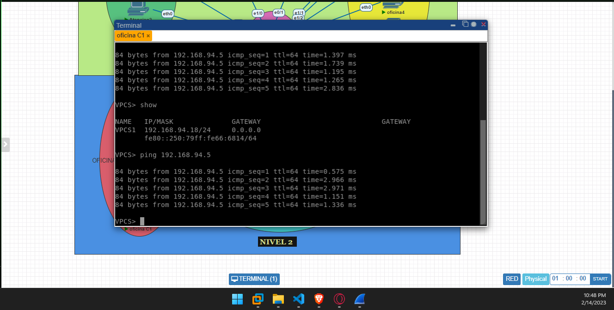
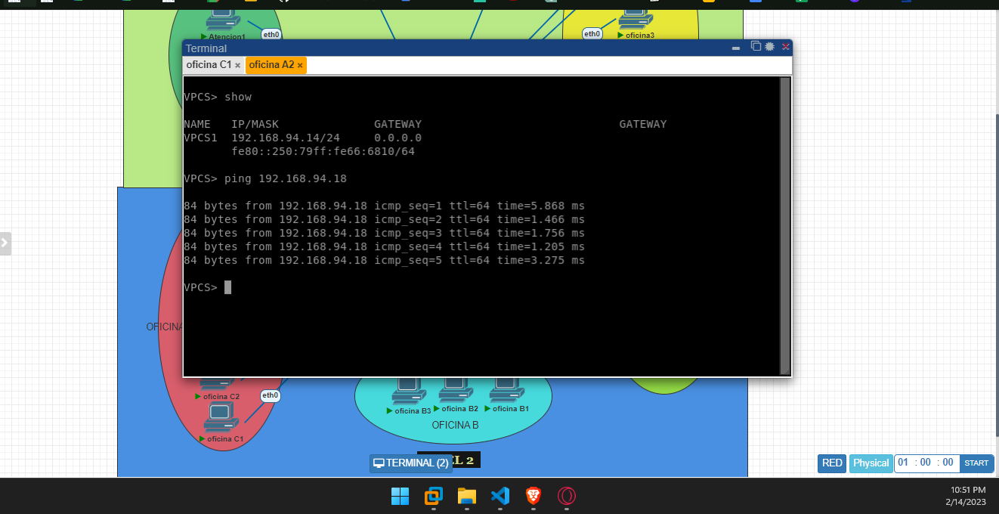

UNIVERSIDAD DE SAN CARLOS DE GUATEMALA

FACULTAD DE INGENIERIA

ESCUELA DE CIENCIAS Y SISTEMAS

REDES DE COMPUTADORAS 1

PRIMER SEMESTRE 2023

---

---

---

---

---

---

---

 <h1>PRACTICA #1</h1> 

<!-- 
 <h1>CALCULADORA</h1> 
 -->

---

---

---

---

| Nombre   |      Carnet      |  
|----------|:-------------:|
| Alvaro Emmanuel Socop Pérez | 202000194 | 

---

---

---

---

---

---

---

---

---

# MANUAL TECNICO

>“Programa desarrollado en PNETLAB.”
## ÍNDICE

| Topico | Link |
| ------ | ------ |
| Introducción | [Ir](#intro) |
| Información del sistema | [Ir](#inf) |
| Objetivos y alcances del sistema| [Ir](#ob) |
| Información del Sistema requerido | [Ir](#sis) |
| Sistema Operativo | [Ir](#sis) |
| Tecnologías utilizadas | [Ir](#tech) |
| Interfaz del programa | [Ir](#inter) |
| Conclusiones | [Ir](#Conclu) |
## INTRODUCCIÓN
Este informe tiene como objetivo demostrar la configuración de las VPCs en un ambiente de prueba utilizando PnetLab. Se explicará cómo se configuró cada una de las VPCs y cómo se estableció la comunicación entre ellas. También se demostrará cómo capturar un paquete ARP y se discutirán los objetivos y conclusiones de la prueba.
# Reporte de Configuración de VPCs y Comunicación entre Áreas

## Configuración de las VPCs

Para esta prueba se crearon un total de siete áreas, cada una de ellas con sus propias VPC. La configuración de las VPCs incluyó la asignación de direcciones IP y la configuración de las interfaces de red. A continuación se muestra una lista de las direcciones IP asignadas a cada VPC:

| Dirección IP    | Nombre de host  |
|:----------------:|:----------------:|
| 192.168.94.3    | recepcion      |
| 192.168.94.4    | gerencia       |
| 192.168.94.5    | atencion1      |
| 192.168.94.6    | atencion2      |
| 192.168.94.7    | oficina 1      |
| 192.168.94.8    | oficina 2      |
| 192.168.94.9    | oficina 3      |
| 192.168.94.10   | oficina 4      |
| 192.168.94.11   | oficina 5      |
| 192.168.94.12   | oficina 6      |
| 192.168.94.13   | oficina A1     |
| 192.168.94.14   | oficina A2     |
| 192.168.94.15   | oficina B1     |
| 192.168.94.16   | oficina B2     |
| 192.168.94.17   | oficina B3     |
| 192.168.94.18   | oficina C1     |
| 192.168.94.19   | oficina C2     |
| 192.168.94.20   | oficina C3     |
| 192.168.94.21   | oficina C4     |
| 192.168.94.22   | oficina C5     |

Cada VPC fue configurada con una máscara de subred de 255.255.255.0 y se conectó a un switch virtual.

## Pings entre los hosts

Para demostrar la comunicación entre las áreas se realizó un ping desde las siguentes VPC's:

- Ping de la VPC de Gerencia hacia la VPC Oficina A1:

- Ping de la VPC de Oficina C1 hacia la VPC Atencion al cliente 1: (vun25_0)

- Ping de la VPC de Oficina A2 hacia la VPC Oficina C1: (vun20_0)

 " En todos casos, se recibió una respuesta positiva. "

Para verificar la comunicacion se escucho en Wireshark y se tomaron los paquetes que se recibian al hacer ping:

- Wireshark con filtro ICMP de la VPC de Gerencia hacia la VPC Oficina A1:

- Wireshark con filtro ICMP Ping de la VPC de Oficina C1 hacia la VPC Atencion al cliente 1: (vun25_0)

- Wireshark con filtro ICMP Ping de la VPC de Oficina A2 hacia la VPC Oficina C1: (vun20_0)

## Captura de un paquete ARP

Se capturó un paquete ARP utilizando la herramienta Wireshark. A continuación se muestra una captura de pantalla del paquete ARP capturado:

##  Conclusiones

El objetivo de esta prueba fue demostrar la capacidad de PnetLab para simular una red de área local (LAN) y permitir la configuración de las VPCs y la comunicación entre ellas. Se logró demostrar que las VPCs podían comunicarse entre sí y que era posible capturar paquetes ARP utilizando PnetLab. Como resultado, se concluye que PnetLab es una herramienta útil para la configuración y prueba de redes de área local.

## Anexos

