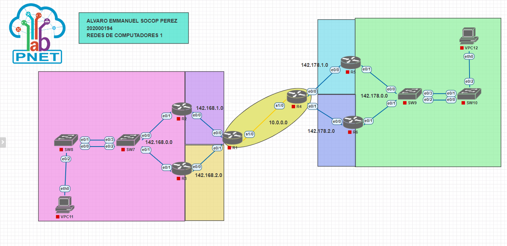

<p>UNIVERSIDAD DE SAN CARLOS DE GUATEMALA</p>
<p>FACULTAD DE INGENIERIA</p>
<p>ESCUELA DE CIENCIAS Y SISTEMAS</p>
<p>REDES DE COMPUTADORAS 1</p>
<p>PRIMER SEMESTRE 2023</p>

---

---

---

---

---

---

---

<div align="center">
<a href="https://git.io/typing-svg"></a>
</div>

---

---

---

---

| Nombre                      |  Carnet   |
| --------------------------- | :-------: |
| Alvaro Emmanuel Socop Pérez | 202000194 |

---

---

---

---

---

---

---

---

---

# <a name="nothing"></a>MANUAL TECNICO

> “Programa desarrollado en PNETLAB.”

## <a name="intro" ></a>ÍNDICE

| Topico                            | Link          |
| --------------------------------- | ------------- |
| Introducción                      | [Ir](#intro)  |
| Información del sistema           | [Ir](#inf)    |
| Capturas de pantalla de Wireshark | [Ir](#ob)     |
| Configuracion de VPC's            | [Ir](#tech)   |
| Interfaz del programa             | [Ir](#inter)  |
| Conclusiones                      | [Ir](#Conclu) |

## <a name="intro" ></a>INTRODUCCIÓN

En el mundo actual, la comunicación y la conectividad son aspectos esenciales para cualquier organización o institución que desee expandir su alcance y mejorar su eficiencia. El Colegio Inmanol, consciente de esta realidad, ha creado la Academia Técnica de Formación Empresarial – TECAP, con el objetivo de ofrecer una educación técnica y empresarial de calidad. Para lograr esto, se requiere una infraestructura de comunicaciones adecuada y eficiente que permita la interconexión entre diferentes ubicaciones, incluyendo redes privadas y redundancia de enlaces. En este contexto, se ha confiado en un experto en el tema para realizar una simulación de la topología de la red, con el fin de garantizar una comunicación fluida y sin interrupciones.

La interconexión de diferentes ubicaciones es una necesidad en cualquier organización o institución que desee expandir su alcance y mejorar su eficiencia. La creación de la Academia Técnica de Formación Empresarial – TECAP por parte del Colegio Inmanol es una clara muestra de este objetivo. Sin embargo, para lograr una comunicación fluida y sin interrupciones se requiere una infraestructura adecuada de comunicaciones que permita la interconexión entre diferentes ubicaciones, incluyendo redes privadas y redundancia de enlaces. En este sentido, la simulación de la topología de la red es fundamental para garantizar una comunicación eficiente y sin fallas.

# 1 Configuraciónes de: routers, switches y VPCs

## R1

## R2

## R5

## SW7

## VPC11

# 2 Resumen de los comandos usados:

### Creación de ruta estática

### creación de PortChannel con PAGP y LACP
- PAGP:
```
!  --------- Configuracion

interface Port-channel 1
description conexion a SW7

interface range e0/0-1
channel-group 1 mode desirable
no shutdown
```
```
interface range e0/2-3
channel-group 1 mode auto
no shutdown
```
- LACP:
```
interface Port-channel 2
description conexion a SW10 con LACP
exit
interface range e0/2-3
channel-group 2 mode active
end
```
```
interface Port-channel 2
description conexion a SW9 con LACP
exit
interface range e0/1-0
channel-group 2 mode passive
```
### creación de IP virtual con HSRP y GLBP
- HSRP:
```

!usamos la version 2 de HSRP
standby version 2

!definimos su id de grupo HSRP y la dirección ip virtual del gateway
standby 21 ip  142.168.0.1

!también le definimos su prioridad
standby 21 priority 109

!configuramos el preempt, que sirve para que recupere la prioridad una se recupere la comunicación
standby 21 preempt
```
```
standby version 2
standby 21 ip 142.168.0.1
```

- GLBP:
```
! CONFIGURACION DE GLBP
glbp 7 ip 142.178.0.1
glbp 7 preempt
glbp 7 priority 150
glbp 7 load-balancing round-robin

```
```
glbp 7 ip 142.178.0.1
glbp 7 load-balancing round-robin
```
### configuración de VPC.
###  VPC11

```C
ip 142.168.0.4/24 192.168.0.1
save
```

###  VPC12

```C
ip 192.178.0.4/24 192.168.0.1
save
```

# 3 Comandos empleados para la verificación .
correcto funcionamiento de los protocolos empleados para la realización de la práctica.

- Verificando la configuración de LACP SW9 y SW10
```
show etherchannel summary
show lacp neighbor
```
- Verificando la configuración de PAGP SW7 y SW8
```
show etherchannel summary
show pagp neighbor
```

- Verificando la configuración de HSRP SW7 y SW8

```c
show standby brief
```

- Verificando la configuración de GLBP SW9 y SW10

```c
show glbp brief
```

- verificando la configuración de las rutas de interfaces

```c
show ip route
show running-config | section ip route
```
<div align="center">
<table  style="color: black;">
  <tr  style="background-color:red; color: white;">
    <th>Dispositivo</th>
    <th>Interfaz</th>
    <th>IP</th>
    <th>Máscara de subred</th>
  </tr>
  <tr v style="background-color:#ffff99;">
    <td>R1</td>
    <td>s1/0</td>
    <td>10.0.0.1</td>
    <td>/30</td>
  </tr>
  <tr style="background-color:#ff80ff;">
    <td></td>
    <td>e0/0</td>
    <td>142.168.1.2</td>
    <td>/29</td>
  </tr>
  <tr  style="background-color:#ff9900;">
    <td></td>
    <td>e0/1</td>
    <td>142 .168.2.2</td>
    <td>/29</td>
  </tr>
  <tr  style="background-color:#ff80ff;">
    <td>R2</td>
    <td>e0/0</td>
    <td>142.168.1.1</td>
    <td>/29</td>
  </tr>
  <tr style="background-color:#ff7c80;">
    <td></td>
    <td>e0/1</td>
    <td>142 .168.0.2</td>
    <td>/24</td>
  </tr>
  <tr style="background-color:#ff9900;">
    <td>R3</td>
    <td>e0/0</td>
    <td>142 .168.2.1</td>
    <td>/29</td>
  </tr>
  <tr style="background-color:#ff7c80;">
    <td></td>
    <td>e0/1</td>
    <td>142.168.0.3</td>
    <td>/24</td>
  </tr>
  <tr style="background-color:#ff7c80;">
    <td>R2-R3</td>
    <td>Virtual</td>
    <td>142.168.0.1</td>
    <td>/24</td>
  </tr>
  <tr style="background-color:#ff7c80;">
    <td>VPC11</td>
    <td>eth0</td>
    <td>142.168.0.4</td>
    <td>/24</td>
  </tr>
  <tr style="background-color:#ffff99;">
    <td>R4</td>
    <td>s1/0</td>
    <td>10.0.0.2</td>
    <td>/30</td>
  </tr>
  <tr style="background-color:#ccffcc;">
    <td></td>
    <td>e0/0</td>
    <td>142.178.1.1</td>
    <td>/29</td>
  </tr>
    <tr style="background-color:#ccffff;">
      <td>R5</td>
      <td>e0/1</td>
      <td>142.178.2.1</td>
      <td>/29</td>
    </tr>
    <tr  style="background-color:#ccffcc;">
        <td></td>
        <td>e0/0</td>
        <td>142.178.1.2</td>
        <td>/29</td>
    </tr>
    <tr  style="background-color:#ccffcc;">
      <td>R6</td>
      <td>e0/1</td>
      <td>142.178.0.2</td>
      <td>/24</td>
    </tr>
    <tr  style="background-color:#ccffff;">
        <td></td>
        <td>e0/0</td>
        <td>142.178.2.2</td>
        <td>/29</td>
    </tr>
    <tr  style="background-color:#ccffcc;">
        <td></td>
        <td>e0/1</td>
        <td>142.178.0.3</td>
        <td>/24</td>
    </tr>
    <tr  style="background-color:#ccffcc;">
        <td>R5-R6</td>
        <td>Virtual</td>
        <td>142.178.0.1</td>
        <td>/24</td>
    </tr>
    <tr  style="background-color:#ccffcc;">
        <td>VPC12</td>
        <td>eth0</td>
        <td>142.178.0.4</td>
        <td>/24</td>
    </tr>
</table>


#  Captura de la implementacion de la topologia

## Interfaz de la Red


</div>

# Conclusiones

El objetivo de esta prueba fue demostrar la capacidad de PnetLab para simular una red de área local (LAN) y permitir la configuración de las VPCs y la comunicación entre ellas. Se logró demostrar que las VPCs podían comunicarse entre sí

Después de realizar la simulación de la topología de red para la Academia Técnica de Formación Empresarial - TECAP, se puede concluir que la implementación de una red redundante es esencial para garantizar la continuidad de la comunicación entre los dos sitios, y también para aumentar la disponibilidad de los servicios de red. Además, se recomienda utilizar una arquitectura de red jerárquica que permita la segmentación de la red en varias subredes y facilite la gestión de la red en su conjunto. También se debe tener en cuenta la seguridad de la red, implementando medidas de protección adecuadas, como firewalls y autenticación de usuarios. En general, una buena planificación de la topología de red es crucial para garantizar una comunicación eficiente y segura entre los sitios y para la satisfacción de los usuarios de la red.

utilizando PnetLab. Como resultado, se concluye que PnetLab es una herramienta útil para la configuración y prueba de redes de área local.

## Anexos

### CONFIGURACIONES DE LOS HOSTS

### 1. VPC11

```C
ip 142.168.0.4/24 192.168.0.1
save
```

### 2. VPC12

```C
ip 192.178.0.4/24 192.168.0.1
save
```
## PORT CHANNEL

### 3. SW8

```java
enable
configure terminal
host SW8-

!  --------- Configuracion

interface Port-channel 1
description conexion a SW7

interface range e0/0-1
channel-group 1 mode desirable
no shutdown
end
do write
```

### 4. SW7

```java
enable
configure terminal
host SW7

!  --------- Configuracion

interface range e0/2-3
channel-group 1 mode auto
no shutdown
end

do write
```

### 5. R2

```java
enable
configure terminal
host R2

!configuramos el primer enlace entre routers
interface e0/0
ip address 142.168.1.1 255.255.255.248
no shutdown

!configuramos la primera interfaz
interface e0/1
ip address 142.168.0.2 255.255.255.0
no shutdown

!usamos la version 2 de HSRP
standby version 2

!definimos su id de grupo HSRP y la dirección ip virtual del gateway
standby 21 ip  142.168.0.1

!también le definimos su prioridad
standby 21 priority 109

!configuramos el preempt, que sirve para que recupere la prioridad una se recupere la comunicación
standby 21 preempt


!configuramos las rutas estáticas
ip route 10.0.0.0 255.255.255.252 142.168.1.2

ip route 142.178.1.0 255.255.255.0 142.168.1.2
ip route 142.178.2.0 255.255.255.0 142.168.1.2
ip route 142.178.0.0 255.255.255.0 142.168.1.2

ip route 142.168.1.0 255.255.255.0 142.168.1.2
ip route 142.168.2.0 255.255.255.0 142.168.1.2

end
do write
```
### 6. R3

```java
enable
configure terminal
host R3

!configuramos el primer enlace entre routers
interface e0/0
ip address 142.168.2.1 255.255.255.248
no shutdown

!configuramos la primera interfaz
interface e0/1
ip address 142.168.0.3 255.255.255.0
no shutdown


standby version 2
standby 21 ip 142.168.0.1


!configuramos las rutas estáticas
ip route 10.0.0.0 255.255.255.252 142.168.2.2

ip route 142.178.1.0 255.255.255.0 142.168.2.2
ip route 142.178.2.0 255.255.255.0 142.168.2.2
ip route 142.178.0.0 255.255.255.0 142.168.2.2

ip route 142.168.1.0 255.255.255.0 142.168.2.2
ip route 142.168.2.0 255.255.255.0 142.168.2.2
end
do write
```
### 7. R1

```java
enable
configure terminal
host R1

!configuramos ROUTERS
interface e0/0
ip address 142.168.1.2 255.255.255.248
no shutdown

interface e0/1
ip address 142.168.2.2 255.255.255.248
no shutdown

!configuracion interfaz serial
interface s1/0
ip address 10.0.0.1 255.255.255.252
no shutdown

!configuramos las rutas estáticas
ip route 10.0.0.0 255.255.255.252 10.0.0.2

ip route 142.178.1.0 255.255.255.0 10.0.0.2
ip route 142.178.2.0 255.255.255.0 10.0.0.2
ip route 142.178.0.0 255.255.255.0 10.0.0.2

ip route 142.168.1.0 255.255.255.0 142.168.1.1
ip route 142.168.2.0 255.255.255.0 142.168.2.1
ip route 142.168.0.0 255.255.255.0 142.168.1.1
end
do write
```

### 8. R4

```java
enable
configure terminal
host R4

!configuramos ROUTERS
interface e0/0
ip address 142.178.1.1 255.255.255.248
no shutdown

interface e0/1
ip address 142.178.2.1 255.255.255.248
no shutdown

!configuracion interfaz serial****************************
interface s1/0
ip address 10.0.0.2 255.255.255.252
no shutdown

!configuramos las rutas estáticas
ip route 10.0.0.0 255.255.255.252 10.0.0.1

ip route 142.178.1.0 255.255.255.0 142.178.1.2
ip route 142.178.2.0 255.255.255.0 142.178.2.2
ip route 142.178.0.0 255.255.255.0 142.178.1.2

ip route 142.168.1.0 255.255.255.0 10.0.0.1
ip route 142.168.2.0 255.255.255.0 10.0.0.1
ip route 142.168.0.0 255.255.255.0 10.0.0.1
end
do write
```
### 9. R5

```java
enable
configure terminal
host R5

!configuramos ROUTERS
interface e0/0
ip address 142.178.1.2 255.255.255.248
no shutdown

interface e0/1
ip address 142.178.0.2 255.255.255.0
no shutdown

! CONFIGURACION DE GLBP
glbp 7 ip 142.178.0.1
glbp 7 preempt
glbp 7 priority 150
glbp 7 load-balancing round-robin


!configuramos las rutas estáticas
ip route 10.0.0.0 255.255.255.252 142.178.1.1

ip route 142.178.1.0 255.255.255.0 142.178.1.1
ip route 142.178.2.0 255.255.255.0 142.178.1.1

ip route 142.168.0.0 255.255.255.0 142.178.1.1
ip route 142.168.1.0 255.255.255.0 142.178.1.1
ip route 142.168.2.0 255.255.255.0 142.178.1.1
end
do write
```

### 10. R6

```java
enable
configure terminal
host R6

!configuramos ROUTERS
interface e0/0
ip address 142.178.2.2 255.255.255.248
no shutdown

interface e0/1
ip address 142.178.0.3 255.255.255.0
no shutdown


glbp 7 ip 142.178.0.1
glbp 7 load-balancing round-robin


!configuramos las rutas estáticas
ip route 10.0.0.0 255.255.255.252 142.178.2.1

ip route 142.178.1.0 255.255.255.0 142.178.2.1
ip route 142.178.2.0 255.255.255.0 142.178.2.1

ip route 142.168.0.0 255.255.255.0 142.178.2.1
ip route 142.168.1.0 255.255.255.0 142.178.2.1
ip route 142.168.2.0 255.255.255.0 142.178.2.1
end
do write
```

### 12. SW9

```java
enable
configure terminal
host SW9

!  --------- Configuracion

interface Port-channel 2
description conexion a SW10 con LACP
exit
interface range e0/2-3
channel-group 2 mode active
end

do write
```
### 13. SW10

```java
enable
configure terminal
host SW10

!  --------- Configuracion

interface Port-channel 2
description conexion a SW9 con LACP
exit
interface range e0/1-0
channel-group 2 mode passive
end

do write
```


