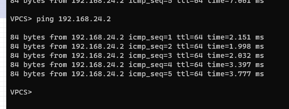
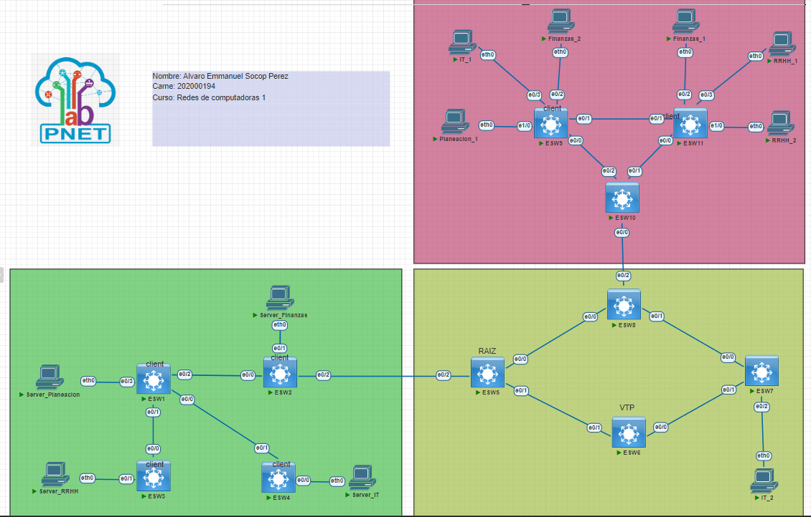

<p>UNIVERSIDAD DE SAN CARLOS DE GUATEMALA</p>
<p>FACULTAD DE INGENIERIA</p>
<p>ESCUELA DE CIENCIAS Y SISTEMAS</p>
<p>REDES DE COMPUTADORAS 1</p>
<p>PRIMER SEMESTRE 2023</p>

---


---


---


---


---


---


---

<center> <a href="https://git.io/typing-svg"></a> </center>
<!-- <center> <h1>CALCULADORA</h1> </center> -->


---


---


---


---


| Nombre   |      Carnet      |  
|----------|:-------------:|
| Alvaro Emmanuel Socop Pérez | 202000194 | 

---


---


---


---


---


---


---


---


---

# <a name="nothing"></a>MANUAL TECNICO


>“Programa desarrollado en PNETLAB.”
## <a name="intro" ></a>ÍNDICE

| Topico | Link |
| ------ | ------ |
| Introducción | [Ir](#intro) |
| Información del sistema | [Ir](#inf) |
| Capturas de pantalla de Wireshark| [Ir](#ob) |
| Configuracion de VPC's | [Ir](#tech) |
| Interfaz del programa | [Ir](#inter) |
| Conclusiones | [Ir](#Conclu) |
## <a name="intro" ></a>INTRODUCCIÓN
Este informe tiene como objetivo demostrar la configuración de las VPCs en un ambiente de prueba utilizando PnetLab. Se explicará cómo se configuró cada una de las VPCs y cómo se estableció la comunicación entre ellas. También se demostrará cómo capturar un paquete ARP y se discutirán los objetivos y conclusiones de la prueba.
# Reporte de Configuración de VPCs y Comunicación entre Áreas
## Pings entre los hosts

Para demostrar la comunicación entre las áreas se realizó un ping desde las siguentes VPC's:

- Ping de la VPC de Gerencia hacia la VPC Oficina A1:


- Ping de la VPC de Oficina C1 hacia la VPC Atencion al cliente 1: (vun25_0)


- Ping de la VPC de Oficina A2 hacia la VPC Oficina C1: (vun20_0)


 " En todos casos, se recibió una respuesta positiva. "
## Captura de un paquete ARP - ICMP

Se capturó un paquete ARP e ICMP utilizando la herramienta Wireshark. A continuación se muestra una captura de pantalla del paquete ARP capturados:

Para verificar la comunicacion se escucho en Wireshark y se tomaron los paquetes que se recibian al hacer ping:

- VPC de Gerencia hacia la VPC Oficina A1:


- VPC de Oficina C1 hacia la VPC Atencion al cliente 1: (vun25_0)


- VPC de Oficina A2 hacia la VPC Oficina C1: (vun20_0)


## Captura de un paquete ICMP filtrado

- Wireshark con filtro ICMP de la VPC de Gerencia hacia la VPC Oficina A1:


- Wireshark con filtro ICMP Ping de la VPC de Oficina C1 hacia la VPC Atencion al cliente 1: (vun25_0)


- Wireshark con filtro ICMP Ping de la VPC de Oficina A2 hacia la VPC Oficina C1: (vun20_0)


## Configuración de las VPCs

Para esta prueba se crearon un total de siete áreas, cada una de ellas con sus propias VPC. La configuración de las VPCs incluyó la asignación de direcciones IP y la configuración de las interfaces de red. A continuación se muestra una lista de las direcciones IP asignadas a cada VPC:

| Dirección IP    | Nombre de host  |
|:----------------:|:----------------:|
| 192.168.94.3    | recepcion      |
| 192.168.94.4    | gerencia       |
| 192.168.94.5    | atencion1      |
| 192.168.94.6    | atencion2      |
| 192.168.94.7    | oficina 1      |
| 192.168.94.8    | oficina 2      |
| 192.168.94.9    | oficina 3      |
| 192.168.94.10   | oficina 4      |
| 192.168.94.11   | oficina 5      |
| 192.168.94.12   | oficina 6      |
| 192.168.94.13   | oficina A1     |
| 192.168.94.14   | oficina A2     |
| 192.168.94.15   | oficina B1     |
| 192.168.94.16   | oficina B2     |
| 192.168.94.17   | oficina B3     |
| 192.168.94.18   | oficina C1     |
| 192.168.94.19   | oficina C2     |
| 192.168.94.20   | oficina C3     |
| 192.168.94.21   | oficina C4     |
| 192.168.94.22   | oficina C5     |

Cada VPC fue configurada con una máscara de subred de 255.255.255.0 y se conectó a un switch virtual.

## Interfaz de la Red


##  Conclusiones

El objetivo de esta prueba fue demostrar la capacidad de PnetLab para simular una red de área local (LAN) y permitir la configuración de las VPCs y la comunicación entre ellas. Se logró demostrar que las VPCs podían comunicarse entre sí y que era posible capturar paquetes ARP utilizando PnetLab. Como resultado, se concluye que PnetLab es una herramienta útil para la configuración y prueba de redes de área local.


## Anexos

### CONFIGURACIONES DE LOS HOSTS
```
    vlan 14
    name PLANEACION

    vlan 24
    name FINANZAS

    vlan 34
    name RRHH

    vlan 44
    name IT
```

1. Server_Finanzas
ip 192.168.24.3
save
2. Server_Planeacion
ip 192.168.14.3
save
3. Server_RRHH
ip 192.168.34.3
save
4. Server_IT
ip 192.168.44.3
save
5. ESW1
```BASH
enable
configure terminal
host ESW1
vlan 14
name PLANEACION
vlan 24
name FINANZAS
vlan 34
name RRHH
vlan 44
name IT
interface ethernet 0/3
switchport mode acces
switchport acces vlan 14

interface ethernet 0/1
switchport trunk encapsulation dot1q
switchport mode trunk

interface ethernet 0/0
switchport trunk encapsulation dot1q
switchport mode trunk

interface ethernet 0/2
switchport trunk encapsulation dot1q
switchport mode trunk
do write
```
6. ESW2
```BASH
enable
configure terminal
host ESW2
vlan 14
name PLANEACION
vlan 24
name FINANZAS
vlan 34
name RRHH
vlan 44
name IT
interface ethernet 0/1
switchport mode acces
switchport acces vlan 24

interface ethernet 0/0
switchport trunk encapsulation dot1q
switchport mode trunk

interface ethernet 0/2
switchport trunk encapsulation dot1q
switchport mode trunk
do write
```
7. ESW3
```BASH
enable
configure terminal
host ESW3
vlan 14
name PLANEACION
vlan 24
name FINANZAS
vlan 34
name RRHH
vlan 44
name IT
interface ethernet 0/1
switchport mode acces
switchport acces vlan 34

interface ethernet 0/0
switchport trunk encapsulation dot1q
switchport mode trunk

do write
```
8. ESW4
```BASH
enable
configure terminal
host ESW4
vlan 14
name PLANEACION
vlan 24
name FINANZAS
vlan 34
name RRHH
vlan 44
name IT
interface ethernet 0/0
switchport mode acces
switchport acces vlan 34

interface ethernet 0/1
switchport trunk encapsulation dot1q
switchport mode trunk

do write
```
9. ESW5
```BASH
enable
configure terminal
host ESW5
vlan 14
name PLANEACION
vlan 24
name FINANZAS
vlan 34
name RRHH
vlan 44
name IT
interface ethernet 0/0
switchport trunk encapsulation dot1q
switchport mode trunk

interface ethernet 0/1
switchport trunk encapsulation dot1q
switchport mode trunk

interface ethernet 0/2
switchport trunk encapsulation dot1q
switchport mode trunk

do write
```
10. ESW6
```BASH
enable
configure terminal
host ESW6
vlan 14
name PLANEACION
vlan 24
name FINANZAS
vlan 34
name RRHH
vlan 44
name IT
!  --------- Configuracion de MODOS TRUNCALES
interface ethernet 0/0
switchport trunk encapsulation dot1q
switchport mode trunk

interface ethernet 0/1
switchport trunk encapsulation dot1q
switchport mode trunk
configure terminal

!  --------- Configuracion de VTP SERVER
vtp version 2
vtp mode server
vtp domain 202000194
vtp password usac

do write
```
11. ESW7
```BASH
enable
configure terminal
host ESW7
vlan 14
name PLANEACION
vlan 24
name FINANZAS
vlan 34
name RRHH
vlan 44
name IT
interface ethernet 0/2
switchport mode acces
switchport acces vlan 44

interface ethernet 0/0
switchport trunk encapsulation dot1q
switchport mode trunk

interface ethernet 0/1
switchport trunk encapsulation dot1q
switchport mode trunk
do write
```
12. ESW8
```BASH
enable
configure terminal
host ESW8
vlan 14
name PLANEACION
vlan 24
name FINANZAS
vlan 34
name RRHH
vlan 44
name IT
interface ethernet 0/0
switchport trunk encapsulation dot1q
switchport mode trunk

interface ethernet 0/1
switchport trunk encapsulation dot1q
switchport mode trunk

interface ethernet 0/2
switchport trunk encapsulation dot1q
switchport mode trunk
do write
```
13. ESW11
```BASH
enable
configure terminal
host ESW11
vlan 14
name PLANEACION
vlan 24
name FINANZAS
vlan 34
name RRHH
vlan 44
name IT
interface ethernet 1/0
switchport mode acces
switchport acces vlan 34

interface ethernet 0/3
switchport mode acces
switchport acces vlan 34

interface ethernet 0/2
switchport mode acces
switchport acces vlan 24

interface ethernet 0/0
switchport trunk encapsulation dot1q
switchport mode trunk

interface ethernet 0/1
switchport trunk encapsulation dot1q
switchport mode trunk
do write
```
14. ESW9
```BASH
enable
configure terminal
host ESW9
vlan 14
name PLANEACION
vlan 24
name FINANZAS
vlan 34
name RRHH
vlan 44
name IT
interface ethernet 1/0
switchport mode acces
switchport acces vlan 14

interface ethernet 0/3
switchport mode acces
switchport acces vlan 44

interface ethernet 0/2
switchport mode acces
switchport acces vlan 24

interface ethernet 0/0
switchport trunk encapsulation dot1q
switchport mode trunk

interface ethernet 0/1
switchport trunk encapsulation dot1q
switchport mode trunk
do write
```

15. ESW10

```BASH
enable
configure terminal
host ESW10
vlan 14
name PLANEACION
vlan 24
name FINANZAS
vlan 34
name RRHH
vlan 44
name IT
interface ethernet 0/0
switchport trunk encapsulation dot1q
switchport mode trunk

interface ethernet 0/1
switchport trunk encapsulation dot1q
switchport mode trunk

interface ethernet 0/2
switchport trunk encapsulation dot1q
switchport mode trunk
do write
```

16. IT_2

```BASH
ip 192.168.44.2
save
```

17. Planeacion_1

```BASH
ip 192.168.14.1
save
```

18. IT_1

```BASH
ip 192.168.44.1
save
```

19. Finanzas_2

```BASH
ip 192.168.24.2
save
```

20. Finanzas_1

```BASH
ip 192.168.24.1
save
```

21. RRHH_1

```BASH
ip 192.168.34.1
save
```

22. RRHH_2

```BASH
ip 192.168.34.2
save
```


<!-- esto va en los switch clientes osea todos los demas -->
configure terminal
vtp mode client
vtp domain dominio
vtp password contrasena
do write


do show run