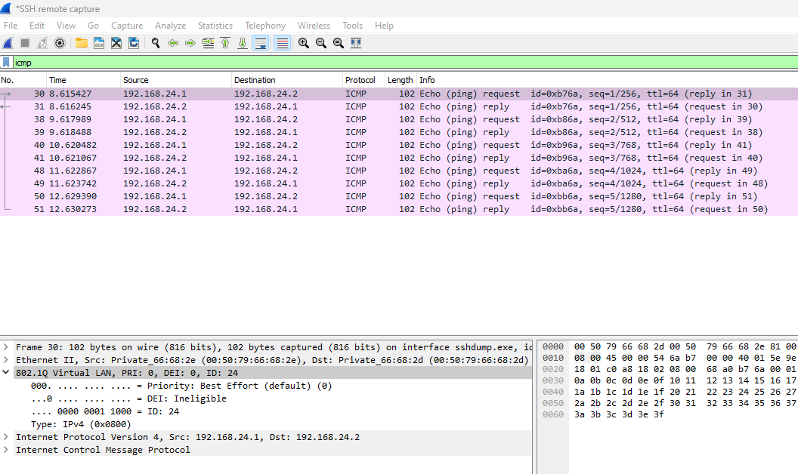
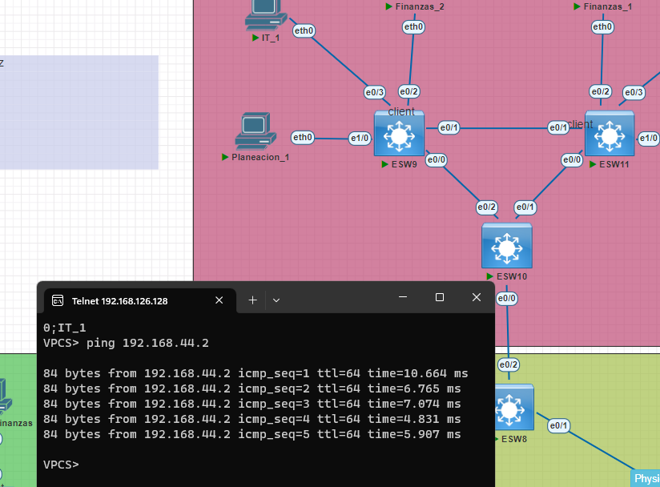
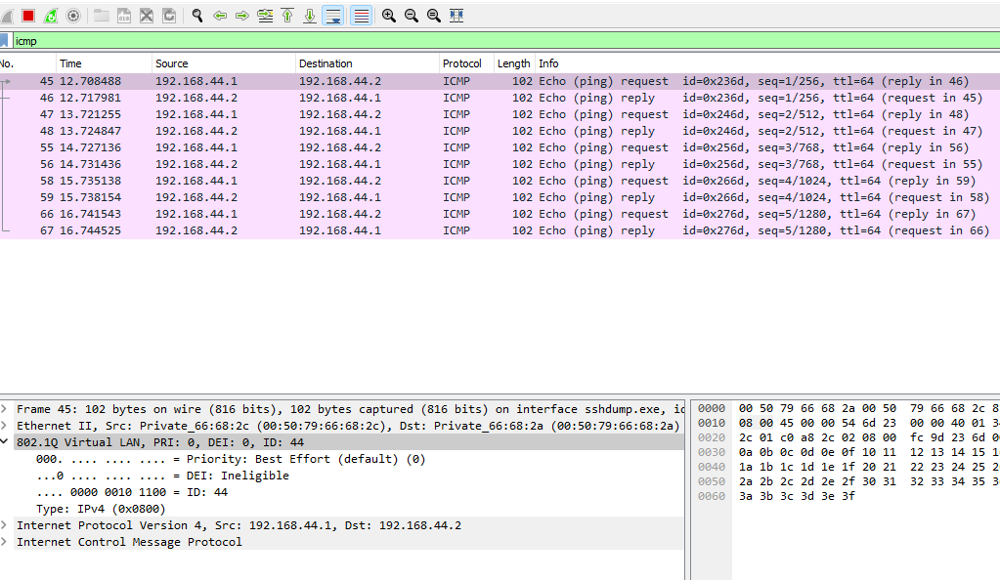

<p>UNIVERSIDAD DE SAN CARLOS DE GUATEMALA</p>
<p>FACULTAD DE INGENIERIA</p>
<p>ESCUELA DE CIENCIAS Y SISTEMAS</p>
<p>REDES DE COMPUTADORAS 1</p>
<p>PRIMER SEMESTRE 2023</p>

---


---


---


---


---


---


---
<div align="center">
<a href="https://git.io/typing-svg"></a>
</div>

<!-- <center> <h1>CALCULADORA</h1> </center> -->


---


---


---


---


| Nombre   |      Carnet      |  
|----------|:-------------:|
| Alvaro Emmanuel Socop Pérez | 202000194 | 

---


---


---


---


---


---


---


---


---

# <a name="nothing"></a>MANUAL TECNICO


>“Programa desarrollado en PNETLAB.”
## <a name="intro" ></a>ÍNDICE

| Topico | Link |
| ------ | ------ |
| Introducción | [Ir](#intro) |
| Información del sistema | [Ir](#inf) |
| Capturas de pantalla de Wireshark| [Ir](#ob) |
| Configuracion de VPC's | [Ir](#tech) |
| Interfaz del programa | [Ir](#inter) |
| Conclusiones | [Ir](#Conclu) |
## <a name="intro" ></a>INTRODUCCIÓN
Este laboratorio se ha desarrollado utilizando Pnet Lab y se ha diseñado con cuatro VLAN para diferentes departamentos: VLAN 14 para PLANEACION, VLAN 24 para FINANZAS, VLAN 34 para RRHH y VLAN 44 para IT. Cada VLAN ha sido nombrada según el departamento correspondiente para una identificación y gestión más fácil.

El departamento de IT tiene servidores, un backbone y un área de trabajo que se han segregado en la VLAN 44 para una mejor seguridad y gestión. El backbone se utiliza para conectar las diferentes VLAN y proporciona una conexión de alta velocidad para la transferencia de datos entre los diferentes departamentos.

Pnet Lab es una plataforma ideal para construir y probar redes, y el uso de VLAN en este laboratorio ha ayudado a crear una infraestructura de red segura y eficiente. La segregación de los departamentos en diferentes VLAN asegura que no haya interferencia entre ellos, y el uso de un backbone ayuda a garantizar que haya una conexión rápida y confiable entre ellos.

En general, este laboratorio es un excelente ejemplo de cómo las VLAN se pueden utilizar para crear una infraestructura de red segura y eficiente, y el uso de Pnet Lab facilita la gestión y el mantenimiento de esta infraestructura.
# 1 Resumen de direcciones IP y VLAN

## Configuración de las VPCs

Para esta prueba se crearon un total de siete áreas, cada una de ellas con sus propias VPC. La configuración de las VPCs incluyó la asignación de direcciones IP y la configuración de las interfaces de red. A continuación se muestra una lista de las direcciones IP asignadas a cada VPC:

| Server Name      | IP Address     |
|:------------------|:----------------:|
| Server_Finanzas  | 192.168.24.3   |
| Server_Planeacion| 192.168.14.3   |
| Server_RRHH      | 192.168.34.3   |
| Server_IT        | 192.168.44.3   |
| IT_2             | 192.168.44.2   |
| Planeacion_1     | 192.168.14.1   |
| IT_1             | 192.168.44.1   |
| Finanzas_2       | 192.168.24.2   |
| Finanzas_1       | 192.168.24.1   |
| RRHH_1           | 192.168.34.1   |
| RRHH_2           | 192.168.34.2   |

### VLANS

| VLAN ID | Name       |
| ------- | ---------- |
| 14      | PLANEACION |
| 24      | FINANZAS   |
| 34      | RRHH       |
| 44      | IT         |

Cada VPC fue configurada con una máscara de subred de 255.255.255.0 y se conectó a varios switches.
| Protocol      | Switch Name     |
|:------------------|:----------------:|
| VTP raiz  | ESW6   |
| STP raiz| ESW5   |
# 2 Captura de la implementacion de las topologias

## Interfaz de la Red


# 3 Detalle de los comandods usados
- enable - ingresa al modo privilegiado

- configure terminal - ingresa al modo de configuración global
- host ESW5 - establece el nombre de host en ESW5
- vtp mode client - establece el modo VTP como cliente
- vtp domain 202000194 - establece el dominio VTP en 202000194
- vtp password usac - establece la contraseña VTP como usac
- interface ethernet 0/0 - ingresa al modo de configuración de interfaz para Ethernet 0/0
- switchport trunk encapsulation dot1q - establece la encapsulación como dot1q para trunking
- switchport mode trunk - establece el modo como trunking
- interface ethernet 0/1 - ingresa al modo de configuración de interfaz para Ethernet 0/1
- interface ethernet 0/2 - ingresa al modo de configuración de interfaz para Ethernet 0/2
- spanning-tree mode rapid-pvst - establece el modo STP como Rapid PVST
- spanning-tree vlan 14,24,34,44 root primary - establece la prioridad de raíz para las VLAN 14, 24, 34 y 44


- vtp version 2 - establece la versión de VTP como 2
- vtp mode server - establece el modo VTP como - servidor
- vtp domain 202000194 - establece el dominio VTP  en 202000194
- vtp password usac  establece la contraseña VTP - como usac
- spanning-tree mode rapid-pvst  establece el  modo STP como Rapid PVST
# 4 Pings entre los hosts

Para demostrar la comunicación entre las áreas se realizó un ping desde las siguentes VPC's:

- Ping de la VPC de Finanzas1 hacia la VPC Finanzas2: tomando la captura en el switch ESW9
 en el puerto 0/0




- Ping de la VPC de IT_1 hacia la VPC IT_2: CAPTURANDO en el switch ESW10 en su puerto 0/0





 " En todos casos, se recibió una respuesta positiva. "


##  Conclusiones

El objetivo de esta prueba fue demostrar la capacidad de PnetLab para simular una red de área local (LAN) y permitir la configuración de las VPCs y la comunicación entre ellas. Se logró demostrar que las VPCs podían comunicarse entre sí y que era posible capturar paquetes  VTP y STP siendo dos protocolos importantes en la configuración de redes de computadoras, y que ambos son útiles para diferentes propósitos. VTP se utiliza para simplificar la administración de VLAN en redes grandes, mientras que STP se utiliza para evitar bucles de red y garantizar la redundancia en la topología de la red. Es importante configurar correctamente ambos protocolos para garantizar un funcionamiento adecuado de la red y evitar problemas de conectividad y seguridad. 

utilizando PnetLab. Como resultado, se concluye que PnetLab es una herramienta útil para la configuración y prueba de redes de área local.


## Anexos

### CONFIGURACIONES DE LOS HOSTS
```
    vlan 14
    name PLANEACION

    vlan 24
    name FINANZAS

    vlan 34
    name RRHH

    vlan 44
    name IT
```

1. Server_Finanzas
```
ip 192.168.24.3
save
```

2. Server_Planeacion
```
ip 192.168.14.3
save
```
3. Server_RRHH
```
ip 192.168.34.3
save
```
4. Server_IT
```
ip 192.168.44.3
save
```
5. ESW1
```BASH
enable
configure terminal
host ESW1

!  --------- Configuracion de VTP CLIENTE
vtp mode client
vtp domain 202000194
vtp password usac

interface ethernet 0/3
switchport mode acces
switchport acces vlan 14

interface ethernet 0/1
switchport trunk encapsulation dot1q
switchport mode trunk

interface ethernet 0/0
switchport trunk encapsulation dot1q
switchport mode trunk

interface ethernet 0/2
switchport trunk encapsulation dot1q
switchport mode trunk
exit
!  --------- Configuracion de STP SWITCH RAIZ
spanning-tree mode rapid-pvst

do write
```
6. ESW2
```BASH
enable
configure terminal
host ESW2

!  --------- Configuracion de VTP CLIENTE
vtp mode client
vtp domain 202000194
vtp password usac

interface ethernet 0/1
switchport mode acces
switchport acces vlan 24

interface ethernet 0/0
switchport trunk encapsulation dot1q
switchport mode trunk

interface ethernet 0/2
switchport trunk encapsulation dot1q
switchport mode trunk
exit
!  --------- Configuracion de STP SWITCH RAIZ
spanning-tree mode rapid-pvst

do write
```
7. ESW3
```BASH
enable
configure terminal
host ESW3

!  --------- Configuracion de VTP CLIENTE
vtp mode client
vtp domain 202000194
vtp password usac

interface ethernet 0/1
switchport mode acces
switchport acces vlan 34

interface ethernet 0/0
switchport trunk encapsulation dot1q
switchport mode trunk
exit
!  --------- Configuracion de STP SWITCH RAIZ
spanning-tree mode rapid-pvst

do write
```
8. ESW4
```BASH
enable
configure terminal
host ESW4

!  --------- Configuracion de VTP CLIENTE
vtp mode client
vtp domain 202000194
vtp password usac

interface ethernet 0/0
switchport mode acces
switchport acces vlan 44

interface ethernet 0/1
switchport trunk encapsulation dot1q
switchport mode trunk
exit
!  --------- Configuracion de STP SWITCH RAIZ
spanning-tree mode rapid-pvst

do write
```
### 9. ESW5  (STP SWITCH RAIZ)
```BASH
enable
configure terminal
host ESW5

!  --------- Configuracion de VTP CLIENTE
vtp mode client
vtp domain 202000194
vtp password usac

interface ethernet 0/0
switchport trunk encapsulation dot1q
switchport mode trunk

interface ethernet 0/1
switchport trunk encapsulation dot1q
switchport mode trunk

interface ethernet 0/2
switchport trunk encapsulation dot1q
switchport mode trunk
exit
!  --------- Configuracion de STP SWITCH RAIZ
spanning-tree mode rapid-pvst
spanning-tree vlan 14,24,34,44 root primary

do write
```
### 10. ESW6    SWITCH RAIZ VTP
```BASH
enable
configure terminal
host ESW6
! --------- Configuracion de VLAN porque es VTP RAIZ
vlan 14
name PLANEACION
vlan 24
name FINANZAS
vlan 34
name RRHH
vlan 44
name IT
exit
!  --------- Configuracion de MODOS TRUNCALES
interface ethernet 0/0
switchport trunk encapsulation dot1q
switchport mode trunk

interface ethernet 0/1
switchport trunk encapsulation dot1q
switchport mode trunk
configure terminal
exit
!  --------- Configuracion de VTP SERVER
vtp version 2
vtp mode server
vtp domain 202000194
vtp password usac

!  --------- Configuracion de STP SWITCH RAIZ
spanning-tree mode rapid-pvst

do write
```
11. ESW7
```BASH
enable
configure terminal
host ESW7
! --------- Configuracion de VLAN porque es transparente
vlan 14
name PLANEACION
vlan 24
name FINANZAS
vlan 34
name RRHH
vlan 44
name IT
exit
interface ethernet 0/2
switchport mode acces
switchport acces vlan 44

interface ethernet 0/0
switchport trunk encapsulation dot1q
switchport mode trunk

interface ethernet 0/1
switchport trunk encapsulation dot1q
switchport mode trunk
exit
!  --------- Configuracion de MODO TRANSPARENTE
vtp mode transparent
vtp domain 202000194
vtp password usac

!  --------- Configuracion de STP SWITCH RAIZ
spanning-tree mode rapid-pvst

do write
```
12. ESW8
```BASH
enable
configure terminal
host ESW8

!  --------- Configuracion de VTP CLIENTE
vtp mode client
vtp domain 202000194
vtp password usac

interface ethernet 0/0
switchport trunk encapsulation dot1q
switchport mode trunk

interface ethernet 0/1
switchport trunk encapsulation dot1q
switchport mode trunk

interface ethernet 0/2
switchport trunk encapsulation dot1q
switchport mode trunk
exit
!  --------- Configuracion de STP SWITCH RAIZ
spanning-tree mode rapid-pvst

do write
```
13. ESW11
```BASH
enable
configure terminal
host ESW11

!  --------- Configuracion de VTP CLIENTE
vtp mode client
vtp domain 202000194
vtp password usac

interface ethernet 1/0
switchport mode acces
switchport acces vlan 34

interface ethernet 0/3
switchport mode acces
switchport acces vlan 34

interface ethernet 0/2
switchport mode acces
switchport acces vlan 24

interface ethernet 0/0
switchport trunk encapsulation dot1q
switchport mode trunk

interface ethernet 0/1
switchport trunk encapsulation dot1q
switchport mode trunk
exit
!  --------- Configuracion de STP SWITCH RAIZ
spanning-tree mode rapid-pvst

do write
```
14. ESW9
```BASH
enable
configure terminal
host ESW9

!  --------- Configuracion de VTP CLIENTE
vtp mode client
vtp domain 202000194
vtp password usac

interface ethernet 1/0
switchport mode acces
switchport acces vlan 14

interface ethernet 0/3
switchport mode acces
switchport acces vlan 44

interface ethernet 0/2
switchport mode acces
switchport acces vlan 24

interface ethernet 0/0
switchport trunk encapsulation dot1q
switchport mode trunk

interface ethernet 0/1
switchport trunk encapsulation dot1q
switchport mode trunk
exit
!  --------- Configuracion de STP SWITCH RAIZ
spanning-tree mode rapid-pvst

do write
```
### 15. ESW10
```BASH
enable
configure terminal
host ESW10
vlan 14
name PLANEACION
vlan 24
name FINANZAS
vlan 34
name RRHH
vlan 44
name IT
interface ethernet 0/0
switchport trunk encapsulation dot1q
switchport mode trunk

interface ethernet 0/1
switchport trunk encapsulation dot1q
switchport mode trunk

interface ethernet 0/2
switchport trunk encapsulation dot1q
switchport mode trunk
exit
!  --------- Configuracion de VTP CLIENTE
vtp mode client
vtp domain 202000194
vtp password usac
!  --------- Configuracion de STP SWITCH RAIZ
spanning-tree mode rapid-pvst

do write
```
16. IT_2
```BASH
ip 192.168.44.2
save
```
17. Planeacion_1
```BASH
ip 192.168.14.1
save
```
18. IT_1
```BASH
ip 192.168.44.1
save
```

19. Finanzas_2

```BASH
ip 192.168.24.2
save
```

20. Finanzas_1

```BASH
ip 192.168.24.1
save
```

21. RRHH_1

```BASH
ip 192.168.34.1
save
```

22. RRHH_2

```BASH
ip 192.168.34.2
save
```


<!-- esto va en los switch clientes osea todos los demas -->
configure terminal
vtp mode client
vtp domain 202000194
vtp password usac
do write


do show run