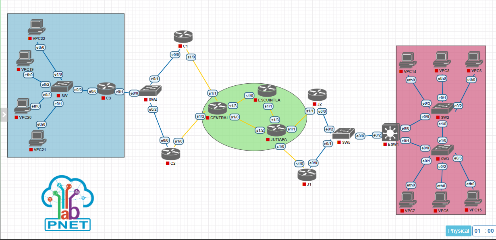

<p>UNIVERSIDAD DE SAN CARLOS DE GUATEMALA</p>
<p>FACULTAD DE INGENIERIA</p>
<p>ESCUELA DE CIENCIAS Y SISTEMAS</p>
<p>REDES DE COMPUTADORAS 1</p>
<p>PRIMER SEMESTRE 2023</p>

---

---

---

---

<div align="center">

<a href="https://git.io/typing-svg" ></a>

</div>

---

---

---

---

<div align="center">

| Nombre                      |  Carnet   |
| --------------------------- | :-------: |
| Alvaro Emmanuel Socop Pérez | 202000194 |

</div>

---

---

---

# <a name="nothing"></a>MANUAL TECNICO

> “Programa desarrollado en PNETLAB.”

## <a name="intro" ></a>ÍNDICE

| Topico                            | Link          |
| --------------------------------- | ------------- |
| Introducción                      | [Ir](#intro)  |
| Información del sistema           | [Ir](#inf)    |
| Capturas de pantalla de Wireshark | [Ir](#ob)     |
| Configuracion de VPC's            | [Ir](#tech)   |
| Interfaz del programa             | [Ir](#inter)  |
| Conclusiones                      | [Ir](#Conclu) |

## <a name="intro" ></a>INTRODUCCIÓN

En el mundo actual, la conectividad es fundamental para el éxito de cualquier empresa. La capacidad de interconectar distintas sedes y departamentos de forma eficiente y segura se ha convertido en una prioridad para muchas organizaciones. En este contexto, se nos ha encomendado el proyecto de interconectar la sede de Jutiapa de una reconocida empresa de venta de línea blanca y electrodomésticos con su central en la ciudad capital. Para lograrlo, deberemos poner en práctica todo el conocimiento adquirido en proyectos anteriores y utilizar herramientas como PNETLab y Wireshark. En particular, tendremos que diseñar una topología de red que incluya la creación de VLANs, el enrutamiento entre ellas, el uso de VLSM y FLSM, así como la configuración de protocolos de enrutamiento estático. Nuestra meta es demostrar la capacidad de implementar una solución de red eficiente y segura que satisfaga las necesidades de nuestro cliente.

Para la red de la sede de Jutiapa, deberemos asignar direcciones de red usando VLSM y configurar interfaces virtuales para la puerta de acceso predeterminada de cada VLAN en el ESW1. También se nos solicita el uso de VTP para la propagación de las VLAN y de RPVST para la prevención de bucles de red. Además, deberemos asignar IPs a las VPCS para permitir la comunicación dentro de cada VLAN y establecer una redundancia de primer salto utilizando HSRP con IPs virtuales para los routers J1 y J2.

Por otro lado, en el Core de la red se utilizará FLSM para la asignación de direcciones de red y se empleará el protocolo de enrutamiento estático para la comunicación entre dispositivos.

# 1. Resumen de direcciones IP y VLAN

- elección de máscara de subred empleada para los distintos requerimientos.


# 2. Capturas de la implementación de las topologías.

## Sede Jutiapa


## Core


## Sede Central


## Completo




# 3. Detalle de los comandos usados

# 1 Configuraciónes de: routers, switches y VPCs

## J1

[ir a la configuracion de R1](#12-J1)

## ESW1

[ir a la configuracion de R2](#14-ESW1)

# 4 CAPTURAS WIRESHARK

### VLAN


### HSRP


# 5 Resumen de los comandos usados:

### Creación de ruta estática

Basicamente lo que se hace es tomar todas las rutas a las que puede llegar los paquetes y usar :

`ip route [destino] [mascara] [salida]`

lo cual permite que los paquetes que lleguen a la red destino puedan ser enviados a la salida que se le indique.

```
!configuramos las rutas estáticas para los paquetes que lleguen a la red destino

ip route 10.0.0.0 255.255.255.252 142.168.2.2

ip route 142.178.1.0 255.255.255.248 142.168.2.2
ip route 142.178.2.0 255.255.255.248 142.168.2.2
ip route 142.178.0.0 255.255.255.0 142.168.2.2

ip route 142.168.1.0 255.255.255.248 142.168.2.2
ip route 142.168.2.0 255.255.255.248 142.168.2.2
```

### creación de IP virtual con HSRP y GLBP

- HSRP:

HSRP permite a un grupo de routers compartir la misma dirección IP virtual como puerta de enlace predeterminada para los dispositivos en la red, proporcionando redundancia y aumentando la disponibilidad de la red. Los routers en el grupo HSRP se comunican entre sí para determinar el router activo, que es responsable de reenviar el tráfico de red hacia la dirección IP virtual. Si el router activo falla, uno de los routers en espera del grupo HSRP asume el papel de router activo automáticamente.

```

!usamos la version 2 de HSRP
standby version 2

!definimos su id de grupo HSRP y la dirección ip virtual del gateway
standby 21 ip  142.168.0.1

!también le definimos su prioridad
standby 21 priority 109

!configuramos el preempt, que sirve para que recupere la prioridad una se recupere la comunicación
standby 21 preempt
```

```
standby version 2
standby 21 ip 142.168.0.1
```

- GLBP:

Al igual que HSRP, GLBP permite a un grupo de routers compartir la misma dirección IP virtual como puerta de enlace predeterminada para los dispositivos en la red, proporcionando redundancia y aumentando la disponibilidad de la red.

```
! CONFIGURACION DE GLBP
glbp 7 ip 142.178.0.1
glbp 7 preempt
glbp 7 priority 150
glbp 7 load-balancing round-robin

```

```
glbp 7 ip 142.178.0.1
glbp 7 load-balancing round-robin
```

# 6 Comandos empleados para la verificación .

correcto funcionamiento de los protocolos empleados para la realización de la práctica.

- Verificando la configuración de HSRP SW7 y SW8

```c
show standby brief
```

- verificando la configuración de las rutas de interfaces

```c
show ip route
show running-config | section ip route
```

# Conclusiones

El objetivo de esta prueba fue demostrar la capacidad de PnetLab para simular una red de área local (LAN) y permitir la configuración de las VPCs y la comunicación entre ellas. Se logró demostrar que las VPCs podían comunicarse entre sí

Después de realizar la simulación de la topología de red para la Academia Técnica de Formación Empresarial - TECAP, se puede concluir que la implementación de una red redundante es esencial para garantizar la continuidad de la comunicación entre los dos sitios, y también para aumentar la disponibilidad de los servicios de red. Además, se recomienda utilizar una arquitectura de red jerárquica que permita la segmentación de la red en varias subredes y facilite la gestión de la red en su conjunto. También se debe tener en cuenta la seguridad de la red, implementando medidas de protección adecuadas, como firewalls y autenticación de usuarios. En general, una buena planificación de la topología de red es crucial para garantizar una comunicación eficiente y segura entre los sitios y para la satisfacción de los usuarios de la red.

utilizando PnetLab. Como resultado, se concluye que PnetLab es una herramienta útil para la configuración y prueba de redes de área local.

# Anexos

### CONFIGURACIONES DE LOS HOSTS

## SEDE CENTRAL

### 1. C1

```bash
enable
configure terminal
host C1

!configuramos el enlace hacia SW4
interface e0/0
no shutdown
ip address 192.177.94.1 255.255.255.0

!SERIAL
interface s1/0
no shutdown
ip address 12.0.0.2 255.255.255.252

exit
!configuramos las rutas estáticas
ip route 10.0.0.0 255.255.255.252 12.0.0.1
ip route 10.0.0.4 255.255.255.252 12.0.0.1
ip route 10.0.0.8 255.255.255.252 12.0.0.1
ip route 11.0.0.0 255.255.255.252 12.0.0.1
ip route 11.0.0.4 255.255.255.252 12.0.0.1
ip route 12.0.0.4 255.255.255.252 12.0.0.1
ip route 192.167.94.0 255.255.255.0 12.0.0.1
ip route 192.168.94.0 255.255.255.0 12.0.0.1
ip route 192.178.94.0 255.255.255.0 192.177.94.4
do write
```

### 2. C2

```bash
enable
configure terminal
host J2

!configuramos el primer enlace entre SW5
interface e0/0
no shutdown
ip address 192.177.94.2 255.255.255.0

!SERIAL
interface s1/0
no shutdown
ip address 12.0.0.6 255.255.255.252

exit
!configuramos las rutas estáticas
ip route 10.0.0.0 255.255.255.252 12.0.0.5
ip route 10.0.0.4 255.255.255.252 12.0.0.5
ip route 10.0.0.8 255.255.255.252 12.0.0.5
ip route 11.0.0.0 255.255.255.252 12.0.0.5
ip route 11.0.0.4 255.255.255.252 12.0.0.5
ip route 12.0.0.0 255.255.255.252 12.0.0.5
ip route 192.167.94.0 255.255.255.0 12.0.0.5
ip route 192.168.94.0 255.255.255.0 12.0.0.5
ip route 192.178.94.0 255.255.255.0 192.177.94.4

do write
```

### 3. C3

```bash
enable
configure terminal
host C3

!configuramos el primer enlace entre C1 y C2

interface Ethernet 0/0
no shutdown

interface Ethernet 0/0.14
no shutdown
encapsulation dot1q 14
ip address 192.178.94.97 255.255.255.240

interface Ethernet 0/0.24
no shutdown
encapsulation dot1q 24
ip address 192.178.94.113 255.255.255.240

interface Ethernet 0/0.34
no shutdown
encapsulation dot1q 34
ip address 192.178.94.1 255.255.255.192

interface Ethernet 0/0.44
no shutdown
encapsulation dot1q 44
ip address 192.178.94.65 255.255.255.224

interface e0/1
ip address 192.177.94.4 255.255.255.0
no shutdown

exit
!configuramos las rutas estáticas
ip route 10.0.0.0 255.255.255.252 192.177.94.2
ip route 10.0.0.0 255.255.255.252 192.177.94.1
ip route 10.0.0.4 255.255.255.252 192.177.94.2
ip route 10.0.0.4 255.255.255.252 192.177.94.1
ip route 10.0.0.8 255.255.255.252 192.177.94.2
ip route 10.0.0.8 255.255.255.252 192.177.94.1
ip route 11.0.0.0 255.255.255.252 192.177.94.2
ip route 11.0.0.0 255.255.255.252 192.177.94.1
ip route 11.0.0.4 255.255.255.252 192.177.94.2
ip route 11.0.0.4 255.255.255.252 192.177.94.1
ip route 12.0.0.0 255.255.255.252 192.177.94.2
ip route 12.0.0.0 255.255.255.252 192.177.94.1
ip route 12.0.0.4 255.255.255.252 192.177.94.2
ip route 12.0.0.4 255.255.255.252 192.177.94.1
ip route 192.167.94.0 255.255.255.0 192.177.94.2
ip route 192.167.94.0 255.255.255.0 192.177.94.1
ip route 192.168.94.0 255.255.255.0 192.177.94.2
ip route 192.168.94.0 255.255.255.0 192.177.94.1
do write
```

### 4. SW

```bash
enable
configure terminal
host SW9

vlan 14
name RRHH
vlan 24
name CONTA
vlan 34
name VENTAS
vlan 44
name INFORMATICA
exit

interface ethernet 0/0
switchport trunk encapsulation dot1q
switchport mode trunk

!  --------- Configuracion de MODO ACCESO (VLANS)
interface ethernet 1/0
switchport mode acces
switchport acces vlan 24

interface ethernet 0/3
switchport mode acces
switchport acces vlan 44

interface ethernet 0/2
switchport mode acces
switchport acces vlan 34

interface ethernet 0/1
switchport mode acces
switchport acces vlan 14


do write
```

### 5. VPC22 CONTA

```bash
ip 192.178.94.114/28 192.178.94.113
save
```

### 6. VPC19 VENTA

```bash
ip 192.178.94.2/26 192.178.94.1
save
```

### 7. VPC20 INFORMATICA

```bash
ip 192.178.94.66/27 192.178.94.65
save
```

### 8. VPC21 RRHH

```bash
ip 192.178.94.98/28 192.178.94.97
save
```

## CORE

### 9. CENTRAL

```bash
enable
configure terminal
host CENTRAL

!configuramos SERIALES
interface s1/0
ip address 10.0.0.5 255.255.255.252
no shutdown

interface s1/1
ip address 12.0.0.1 255.255.255.252
no shutdown

interface s1/2
ip address 12.0.0.5 255.255.255.252
no shutdown

interface s1/3
ip address 10.0.0.1 255.255.255.252
no shutdown

exit

!configuramos las rutas estáticas

ip route 10.0.0.0 255.255.255.252 10.0.0.2
ip route 10.0.0.0 255.255.255.252 10.0.0.6
ip route 11.0.0.0 255.255.255.252 10.0.0.2
ip route 11.0.0.0 255.255.255.252 10.0.0.6
ip route 11.0.0.4 255.255.255.252 10.0.0.2
ip route 11.0.0.4 255.255.255.252 10.0.0.6
ip route 192.167.94.0 255.255.255.0 10.0.0.2
ip route 192.167.94.0 255.255.255.0 10.0.0.6
ip route 192.168.94.0 255.255.255.0 10.0.0.2
ip route 192.168.94.0 255.255.255.0 10.0.0.6

ip route 192.177.94.0 255.255.255.0 12.0.0.2
ip route 192.177.94.0 255.255.255.0 12.0.0.6
ip route 192.178.94.0 255.255.255.0 12.0.0.2
ip route 192.178.94.0 255.255.255.0 12.0.0.6
do write
```

### 10. ESCUINTLA

```bash
enable
configure terminal
host ESCUINTLA

!configuramos SERIALES
interface s1/0
ip address 10.0.0.2 255.255.255.252
no shutdown

interface s1/1
ip address 10.0.0.9 255.255.255.252
no shutdown

exit
!configuramos las rutas estáticas

ip route 10.0.0.4 255.255.255.252 10.0.0.1
ip route 10.0.0.4 255.255.255.252 10.0.0.10
ip route 11.0.0.0 255.255.255.252 10.0.0.10
ip route 11.0.0.4 255.255.255.252 10.0.0.10
ip route 12.0.0.0 255.255.255.252 10.0.0.1
ip route 12.0.0.4 255.255.255.252 10.0.0.1
ip route 192.167.94.0 255.255.255.0 10.0.0.10
ip route 192.168.94.0 255.255.255.0 10.0.0.10
ip route 192.177.94.0 255.255.255.0 10.0.0.1
ip route 192.178.94.0 255.255.255.0 10.0.0.1
do write
```

### 11. JUTIAPA

```bash
enable
configure terminal
host JUTIAPA

!configuramos SERIALES
interface s1/0
ip address 11.0.0.5 255.255.255.252
no shutdown

interface s1/1
ip address 11.0.0.1 255.255.255.252
no shutdown

interface s1/2
ip address 10.0.0.6 255.255.255.252
no shutdown

interface s1/3
ip address 10.0.0.10 255.255.255.252
no shutdown

exit
!configuramos las rutas estáticas
ip route 10.0.0.8 255.255.255.252 10.0.0.9
ip route 10.0.0.8 255.255.255.252 10.0.0.5
ip route 12.0.0.0 255.255.255.252 10.0.0.9
ip route 12.0.0.0 255.255.255.252 10.0.0.5
ip route 12.0.0.4 255.255.255.252 10.0.0.9
ip route 12.0.0.4 255.255.255.252 10.0.0.5

ip route 192.167.94.0 255.255.255.0 11.0.0.2
ip route 192.167.94.0 255.255.255.0 11.0.0.6
ip route 192.168.94.0 255.255.255.0 11.0.0.2
ip route 192.168.94.0 255.255.255.0 11.0.0.6

ip route 192.177.94.0 255.255.255.0 10.0.0.9
ip route 192.177.94.0 255.255.255.0 10.0.0.5
ip route 192.178.94.0 255.255.255.0 10.0.0.9
ip route 192.178.94.0 255.255.255.0 10.0.0.5

do write
```

## SEDE JUTIAPA

### 12. J1

```bash
enable
configure terminal
host J1

! ---------SERIAL
interface s1/0
ip address 11.0.0.6 255.255.255.252
no shutdown

!configuramos el primer enlace entre SW5 y J1
interface e0/0
ip address 192.167.94.2 255.255.255.0
no shutdown

! ---------HSRP usamos la version 2 de
standby version 2

!definimos su id de grupo HSRP y la dirección ip virtual del gateway
standby 21 ip  192.167.94.1

!también le definimos su prioridad
standby 21 priority 109

!configuramos el preempt, que sirve para que recupere la prioridad una se recupere la comunicación
standby 21 preempt

exit
!configuramos las rutas estáticas
ip route 10.0.0.0 255.255.255.252 11.0.0.5
ip route 10.0.0.4 255.255.255.252 11.0.0.5
ip route 10.0.0.8 255.255.255.252 11.0.0.5
ip route 11.0.0.4 255.255.255.252 11.0.0.5
ip route 12.0.0.0 255.255.255.252 11.0.0.5
ip route 12.0.0.4 255.255.255.252 11.0.0.5
ip route 192.168.94.0 255.255.255.0 192.167.94.4
ip route 192.177.94.0 255.255.255.0 11.0.0.5
ip route 192.178.94.0 255.255.255.0 11.0.0.5

do write
```

### 13. J2

```bash
enable
configure terminal
host J2

!SERIAL
interface s1/1
ip address 11.0.0.2 255.255.255.252
no shutdown

!configuramos el primer enlace entre SW5
interface e0/0
ip address 192.167.94.3 255.255.255.0
no shutdown

standby version 2
standby 21 ip 192.167.94.1

exit
!configuramos las rutas estáticas
ip route 10.0.0.0 255.255.255.252 11.0.0.1
ip route 10.0.0.4 255.255.255.252 11.0.0.1
ip route 10.0.0.8 255.255.255.252 11.0.0.1
ip route 11.0.0.0 255.255.255.252 11.0.0.1
ip route 12.0.0.0 255.255.255.252 11.0.0.1
ip route 12.0.0.4 255.255.255.252 11.0.0.1
ip route 192.168.94.0 255.255.255.0 192.167.94.4
ip route 192.177.94.0 255.255.255.0 11.0.0.1
ip route 192.178.94.0 255.255.255.0 11.0.0.1

do write
```

### 14. ESW1

```bash
enable
configure terminal
host ESW1
! --------- Configuracion de VLAN porque es VTP RAIZ
vlan 14
name RRHH
vlan 24
name CONTA
vlan 34
name VENTAS
vlan 44
name INFORMATICA

!  --------- Configuracion de IP
interface e0/0
switchport trunk encapsulation dot1q
switchport mode trunk

interface e0/1
switchport trunk encapsulation dot1q
switchport mode trunk

interface e0/2
no switchport
no shutdown
ip address 192.167.94.4 255.255.255.0

! --------- Configuramos interfaces virtuales para puerta de cada VLAN
interface vlan 14
no shutdown
ip address 192.168.94.49 255.255.255.240

interface vlan 24
no shutdown
ip address 192.168.94.65 255.255.255.248

interface vlan 34
no shutdown
ip address 192.168.94.1 255.255.255.224

interface vlan 44
no shutdown
ip address 192.168.94.33 255.255.255.240

exit
!  --------- Configuracion de VTP SERVER
vtp version 2
vtp mode server
vtp domain 202000194
vtp password usac

!  --------- Configuracion de STP SWITCH RAIZ RPVST
spanning-tree mode rapid-pvst

!configuramos las rutas estáticas
ip route 10.0.0.0 255.255.255.252 192.167.94.2
ip route 10.0.0.0 255.255.255.252 192.167.94.3
ip route 10.0.0.4 255.255.255.252 192.167.94.2
ip route 10.0.0.4 255.255.255.252 192.167.94.3
ip route 10.0.0.8 255.255.255.252 192.167.94.2
ip route 10.0.0.8 255.255.255.252 192.167.94.3
ip route 11.0.0.0 255.255.255.252 192.167.94.2
ip route 11.0.0.0 255.255.255.252 192.167.94.3
ip route 11.0.0.4 255.255.255.252 192.167.94.2
ip route 11.0.0.4 255.255.255.252 192.167.94.3
ip route 12.0.0.0 255.255.255.252 192.167.94.2
ip route 12.0.0.0 255.255.255.252 192.167.94.3
ip route 12.0.0.4 255.255.255.252 192.167.94.2
ip route 12.0.0.4 255.255.255.252 192.167.94.3
ip route 192.177.94.0 255.255.255.0 192.167.94.2
ip route 192.177.94.0 255.255.255.0 192.167.94.3
ip route 192.178.94.0 255.255.255.0 192.167.94.2
ip route 192.178.94.0 255.255.255.0 192.167.94.3
!************ VALICAR SI LA 178 NECESITA ROUTEARSE
do write
```

### 15. SW2

```bash
enable
configure terminal
host SW2

! --------- Configuracion de VTP CLIENTE
vtp mode client
vtp domain 202000194
vtp password usac

!  --------- Configuracion de MODO ACCESO (VLANS)
interface ethernet 0/1
switchport mode acces
switchport acces vlan 14

interface ethernet 0/2
switchport mode acces
switchport acces vlan 44

interface ethernet 0/3
switchport mode acces
switchport acces vlan 34

!  --------- Configuracion DE MODO TRONCAL
interface ethernet 0/0
switchport trunk encapsulation dot1q
switchport mode trunk

interface ethernet 1/0
switchport trunk encapsulation dot1q
switchport mode trunk
exit

do write
```

### 16. SW3

```bash
enable
configure terminal
host SW3

! --------- Configuracion de VTP CLIENTE
vtp mode client
vtp domain 202000194
vtp password usac

!  --------- Configuracion de MODO ACCESO (VLANS)
interface ethernet 0/1
switchport mode acces
switchport acces vlan 34

interface ethernet 0/2
switchport mode acces
switchport acces vlan 24

interface ethernet 0/3
switchport mode acces
switchport acces vlan 24

!  --------- Configuracion DE MODO TRONCAL
interface ethernet 0/0
switchport trunk encapsulation dot1q
switchport mode trunk

interface ethernet 1/0
switchport trunk encapsulation dot1q
switchport mode trunk
exit

do write
```

### 17. VPC14

```C
ip 192.168.94.2/27 192.168.94.1
save
```

### 20. VPC7

```C
ip 192.168.94.3/27 192.168.94.1
save
```

### 19. VPC6

```C
ip 192.168.94.34/28 192.168.94.33
save
```

### 18. VPC8

```C
ip 192.168.94.50/28 192.168.94.49
save
```

### 21. VPC5

```C
ip 192.168.94.66/29 192.168.94.65
save
```

### 22. VPC15

```C
ip 192.168.94.67/29 192.168.94.65
save
```
